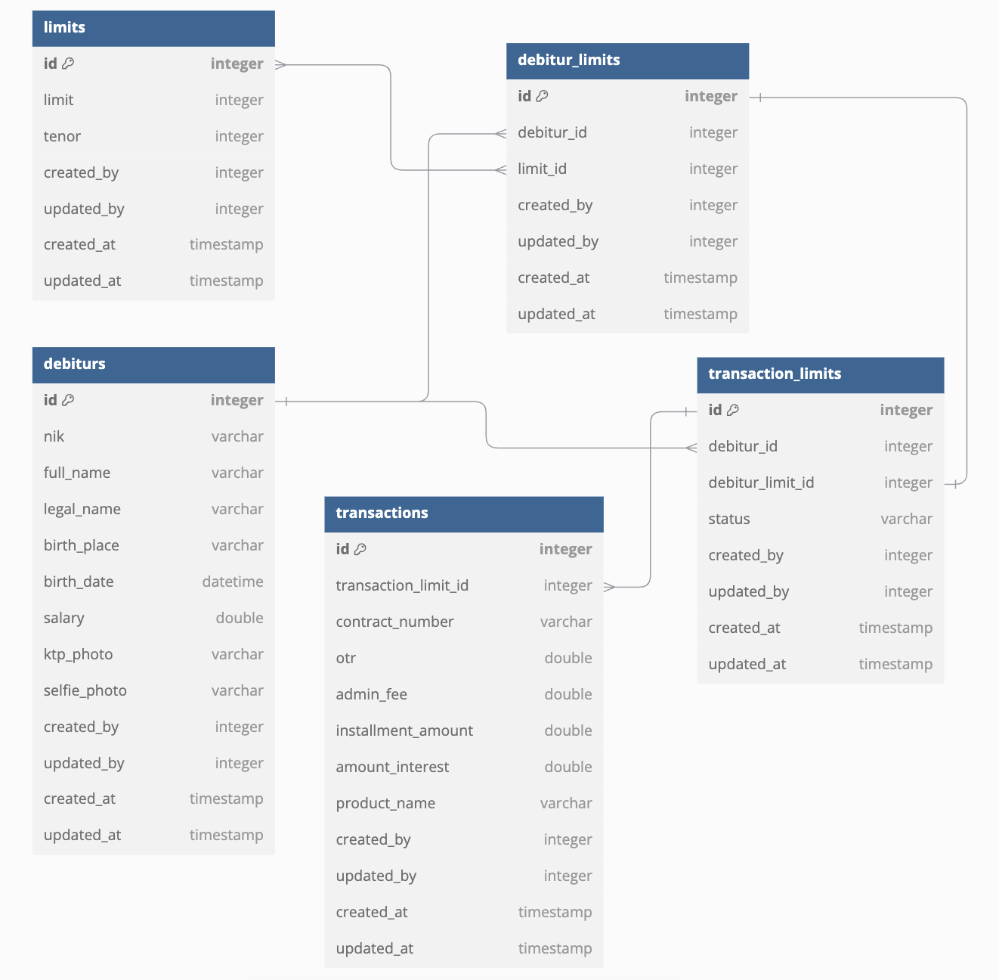

# MULFINANCE
Mulfinance adalah aplikasi untuk credit berdasarkan tenor untuk menetukan limit.

### run app
```
go run .
```

Untuk langkah awal, setelah menjalankan aplikasi, jalankan perintah sql pada file :
- limits... .sql
- debiturs... .sql
- debitur_limits... .sql

### run testing
```
go test -v -cover ./...
```

### generate mock test
```
mockery
```

### entity diagram


### API

## File
- upload

``url``

```
POST localhost:8000/api/upload
```
``request form data``
```json
type : //ktp/selfie
file : //file yang akan di upload
```

## Auth
- login

``url``

```
POST localhost:8000/auth/login
```
``request body``
```json
{
    "username": "admin",
    "password": "password"
}
```
## Limit
- list limit

``url``

```
GET localhost:8000/api/v1/transactions
```

## Transaction
- create transaction

``url``

```
POST localhost:8000/api/v1/transactions
```
``request body``
```json
{
    "debitur_id": 1,
    "debitur_limit_id": 1,
    "otr": 500000,
    "admin_fee": 2500,
    "installment_amount": 50000,
    "amount_interest": 3000,
    "product_name": "Kipas Angin"
}
```
- list transaction

``url``

```
GET localhost:8000/api/v1/transactions
```

## Debitur

- list debitur

``url``

```
GET localhost:8000/api/v1/debiturs
```

- detail debitur

``url``

```
GET localhost:8000/api/v1/debiturs/:id
```

- limit debitur

``url``

```
GET localhost:8000/api/v1/debiturs/:id/limits
```

- transaction debitur

``url``

```
GET localhost:8000/api/v1/debiturs/:id/transactions
```